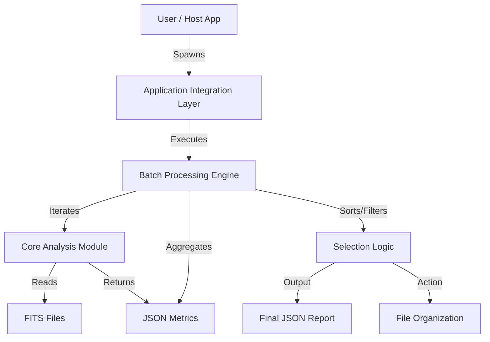

# Product Design Reference (PDR)
## FITS Image Quality Analyzer

### 1. System Overview
The system follows a **Hybrid Orchestration Architecture**, decoupling the high-performance scientific analysis from the application workflow logic.

#### 1.1 High-Level Architecture


### 2. Component Design

#### 2.1 Core Analysis Module
*   **Role**: The "Scientific Engine". Pure functional component.
*   **Tech Stack**: Python, Astropy, Photutils, Scipy.
*   **Key Algorithms**:
    *   **Plate Solving**: Derived from FITS Header (`SECPIX` or `FOCALLEN`/`XPIXSZ`).
    *   **Source Detection**: `DAOStarFinder` (Sigma-clipped thresholding).
    *   **Model Fitting**: `LevMarLSQFitter` (Levenberg-Marquardt non-linear least squares).
*   **Model Implementation Details**:
    *   **Moffat2D**: `astropy.modeling.models.Moffat2D`. Captures atmospheric wings.
    *   **Gaussian2D**: `astropy.modeling.models.Gaussian2D`. Fast approximation.
    *   **Lorentzian2D**: Implemented as Moffat2D with `alpha=1.0` (fixed).

#### 2.2 Batch Processing Engine
*   **Role**: Throughput optimizer and Logic controller.
*   **Tech Stack**: Python (same runtime as Core).
*   **Workflow**:
    1.  **Scan**: `glob` all `*.fit` / `*.fits` files.
    2.  **Analysis Loop**: Calls Core Module logic for each file *in-memory* (no subprocess overhead per file).
    3.  **Scoring & Selection**:
        *   Implements **Evolutive Selection** (Weighted Sum).
        *   Identifies **Reference Frame**.
        *   Calculates **Relative Scores**.
        *   Applies **Cutoffs**.
    4.  **Action**: Generates JSON summary and optionally moves files.

#### 2.3 Application Integration Layer
*   **Role**: API Bridge.
*   **Tech Stack**: Node.js `child_process`.
*   **Interface**:
    *   Spawns the Python process.
    *   Captures `stdout` for JSON data.
    *   Handles `stderr` for logging.
    *   Returns native Promises for easy `await` usage in the host app.

### 3. Data Dictionary (JSON Output)
```json
{
  "summary": {
    "total": 100,
    "accepted": 80,
    "rejected": 20,
    "best_score": 98.5,
    "reference_frame": "image_005.fit"
  },
  "files": [
    {
      "filename": "image_001.fit",
      "status": "accepted",
      "score_relative": 95.2,
      "metrics": {
        "fwhm_arcsec": 2.3,
        "eccentricity": 0.35,
        "snr": 45.0,
        "stars": 150
      }
    }
  ]
}
```

### 4. Technology Decisions
*   **Why Python for Core?**: Unmatched ecosystem for astronomy (`astropy`). Implementing robust Moffat fitting in JS is practically infeasible and prone to numerical instability.
*   **Why Node.js for Integration?**: Matches the user's existing infrastructure, allowing seamless UI integration and non-blocking file management.
